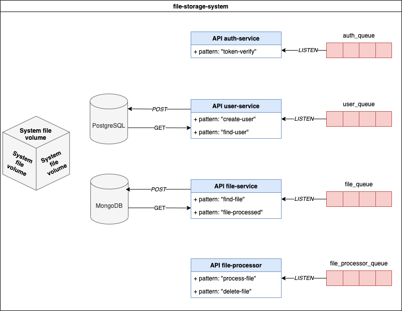
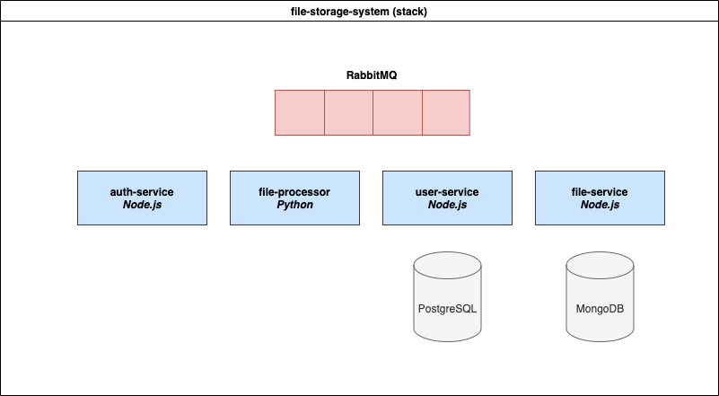

# File storage system

## Table of Contents 
1. [How it works](#1-how-it-works)
    - 1.1 [Queues](#11-queues)
    - 1.2 [Auth service](#12-auth-service)
    - 1.3 [File processor](#13-file-processor)
    - 1.4 [File service](#14-file-service)
    - 1.5 [User service](#15-user-service)
   
2. [Reactive programming](#2-reactive-programming)
    - 2.1 [Use cases](#21-use-cases)
    - 2.2 [Error handling](#22-error-handling)

3. [RPC](#3-rpc)
    - 3.1 [Message pattern logger](#31-message-pattern-logger)
    - 3.2 [Client proxy injection](#32-client-proxy-injection)

4. [ADR](#4-adr)
5. [How to run](#5-how-to-run)

## 1. How it works


Ok I know you look on diagram above a think _"what the ..."_. That was my creativity
but let me start from the beginning ...

Imagine system where authorized users can upload own images on the server and share it
with another peoples. So first user need to create an account, and then he may share file
for others via this app. Basically if you like AWS this is very tiny example of creation own S3 service
_(but please take it with a grain of salt)_.

On AWS S3 we can use Lambda's which listen for events and then make an actions. In this case
app `file-processor` is a _simple_ example of lambda write in python :snake:. The main duty of this service is resize
and clear image from Exif (scroll bellow to know something more).

So to quickly summarize... user create account, sign in, upload image (`*.jpg`, `*.jpeg`, `*.png`)
and then _fake Lambda_ start processing file. It's time for persisting data mechanism. Docker-compose
create a volume **files** which is shared between `file-service`, `file-processor` and `root machine`. It
literally shares a space with two catalogs **unprocessed** and **for share**. I want to avoid situation
where owner of file, doesn't have access for his asset because may be resized at this time. That's why image
is safe in **unprocessed** folder and **only possessor has access** to this resource by **special token** 
generated by `uuidv4` and saved in `Redis` for tiny amount of time. 
Resized, without Exif file is safe in **for-share** folder after finish `file-processor` task, which 
take around 200-300 ms. Everyone have access for this resource now. For cleaning, old one is hardly removed
from **unprocessed** folder also by the same service. 

System is build in microservice architecture and some services use database per service. RabbitMQ's
queues are used for TCP communication between apps using RPC that allows one program to directly
call procedures in another program either on the another container on the network... but it doesn't just do that.
Do you remember `file-processor`? What if will something happen with server where app was deployed 
during processing big image? For this case app use durable queue. You should know that `file-service` sent
message on `file_processor_queue` and this msg is permanent until some receivers will pull and ack this.
This means that after restarting the application, the message will be pulled 
again (if it was not previously confirmed) and all actions will be make to the end. 
This mechanism protects the application from zombies in the **unprocessed** folder.

### 1.1 Queues


Lorem ipsum
### 1.2 Auth service
Lorem ipsum
#### Local strategy
Lorem ipsum
#### Documentation
Lorem ipsum
### 1.3 File processor
Lorem ipsum
#### Aspect ratio
Lorem ipsum
#### Clear image Exif
Lorem ipsum
#### Documentation
Lorem ipsum
### 1.4 File service
Lorem ipsum
#### Database MongoDB
Lorem ipsum
#### Static files and tokens authorization stored by Redis memory database 
Lorem ipsum
#### File validation
Lorem ipsum
#### Documentation
Lorem ipsum
### 1.5 User service
Lorem ipsum
#### Database PostgreSQL
Lorem ipsum
#### Migrations
Lorem ipsum
#### Documentation
Lorem ipsum

## 2. Reactive programming
Lorem ipsum
### 2.1 Use cases
### 2.2 Error handling
```ts
@Catch(RpcException)
export class RpcPatternFilter implements RpcExceptionFilter<RpcException> {
  constructor(private readonly loggerService: LoggerService) {
    loggerService.setContext(RpcPatternFilter.name);
  }

  catch(exception: RpcException, host: ArgumentsHost): Observable<string> {
    this.loggerService.warn(`Caught: [${exception.message}]`);

    throw new Error(exception.message);
  }
}
```

## 3. RPC
Lorem ipsum
***ADD DIAGRAM***
### 3.1 Message pattern logger
### 3.2 Client proxy injection

## 4. ADR
Lorem ipsum

## 5. How to run


